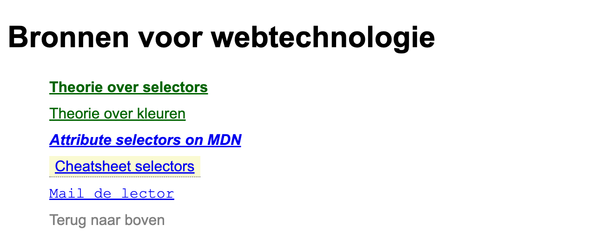

# attribute-selectors

In deze oefening oefen je op de **attribuutselector**. Je selecteert links niet op hun type, class
of id, maar op de attributen die ze meekrijgen in de HTML.

Lees eerst de theorie over [attributen](https://webtechnologie.apload.be/css/selectors/attributen).

`index.html` is gegeven en mag je **niet** aanpassen. Alles wat hieronder gevraagd wordt, los je op
in `css/style.css`. Gebruik in die stylesheet **geen enkele class of id**, enkel type- en
attribuutselectoren.

## Opgave

* alle tekst op de pagina krijgt een font-family van `Arial, Helvetica, sans-serif`
* de lijst verliest zijn opsommingstekens en elk lijstitem krijgt 5px padding
* **links die in een nieuw tabblad openen** (ze hebben een `target`-attribuut met de waarde `_blank`) worden vetgedrukt
* **anderstalige bronnen** (het element heeft een `lang`-attribuut met de waarde `en`) staan schuin
* **links naar onze eigen cursus** (de letterreeks `apload` komt ergens in de `href` voor) worden `darkgreen`
* **de link naar een PDF** (de `href` eindigt op `.pdf`) krijgt `lightgoldenrodyellow` als achtergrondkleur en 2px padding boven en onder, 6px links en rechts
* **de maillink** (de `href` begint met `mailto:`) krijgt een font-family van `"Courier New", Courier, monospace`
* **de interne link** (de `href` begint met `#`) wordt `gray` en is niet onderlijnd
* **elke link met een `title`-attribuut** krijgt een gestippelde onderlijn van 1px in `gray`. Welke waarde in dat `title` staat, maakt niet uit: je selecteert enkel op het bestaan van het attribuut.

> **TIP**: naast `[attribuut]` en `[attribuut="waarde"]` bestaan er drie varianten die naar een stuk
> van de waarde kijken: `^=` (begint met), `$=` (eindigt op) en `*=` (bevat). Je vindt ze alle drie
> terug bij [Attribute selectors op MDN](https://developer.mozilla.org/en-US/docs/Web/CSS/Reference/Selectors/Attribute_selectors).

De link naar de cheatsheet verwijst naar een PDF die niet bestaat. Dat is normaal, je hebt het
bestand niet nodig om de selector te laten werken.

## Controleer achteraf

* "Theorie over selectors" is **zowel** vet **als** darkgreen: dat ene element wordt door twee van
  je selectoren geraakt, en elke selector regelt een andere eigenschap.
* "Theorie over kleuren" is darkgreen maar **niet** vet, want die link heeft geen `target`.
* De link naar MDN is vet en schuin, maar niet darkgreen.

## Verwacht resultaat

